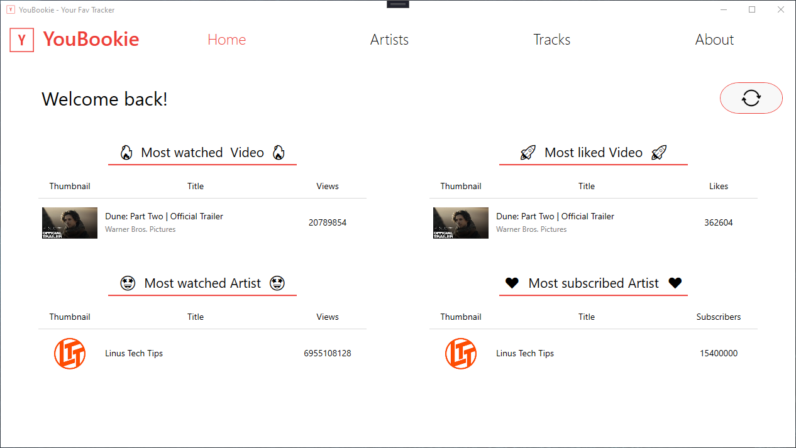
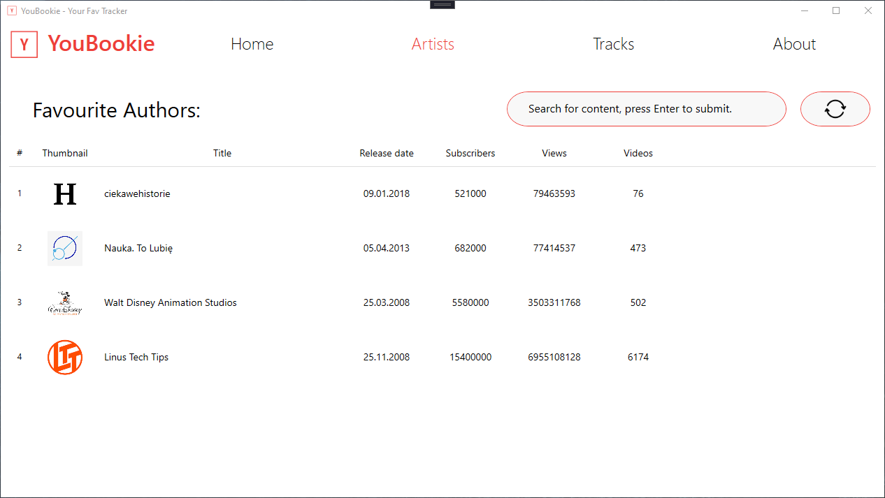
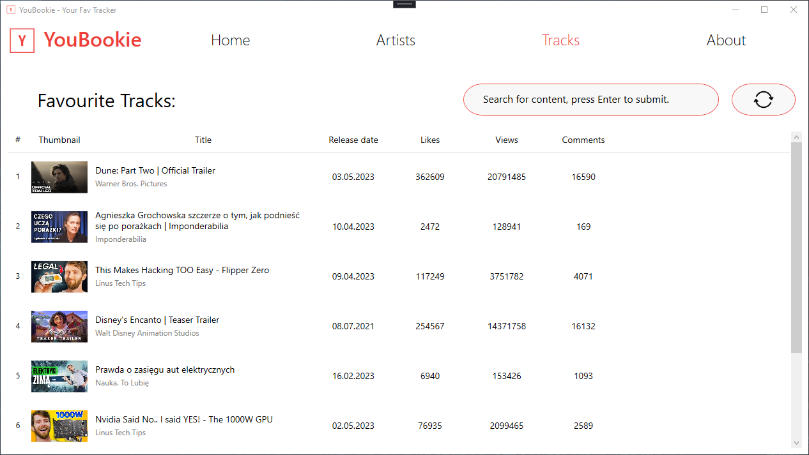
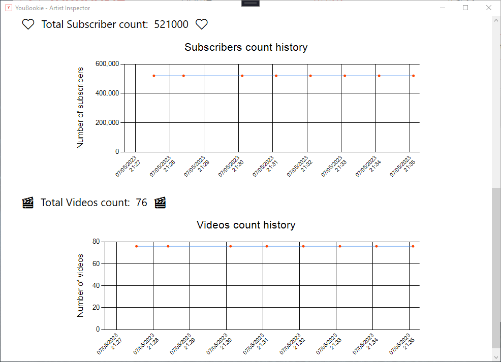
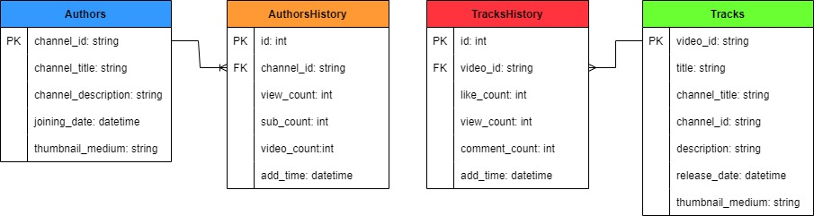

# YouBookie
YouBookie is a simple app which gives you the opportunity to track your favourite videos and channels statistics. Everything is stored in specially designed database.

# Views
Using available views you can simply take a look at the current stats.

# Charts
If you want to check the history of your favourite video or channel, YouBookie will generate charts for you.

# Database
Here is an UML diagram of YouBookie database.

